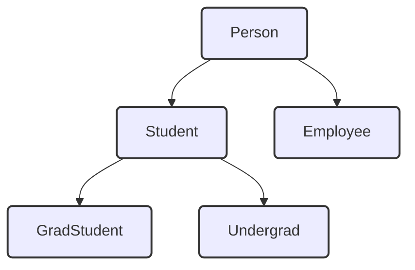

## Inheritance Generals:
- A `subclass` is **bigger** than a `superclass` - it contains more data and more methods!!


- To work with inheritance:
```java
public class Subclass extends Superclass {
}
```
## 2 ways to do `super()`:
- `super()` (in constructor) must be above **ALL** of the other parameters.
```java
	public class GradStudent extends Student {
		private int gradID;

		public GradStudent { //Constructor
			super(); //Call Superclass's constructor - builds essential params.

			OR: super(studName, studTests, studGrade) //Accepted!

			gradID = 0; // unique private additional element
		}
	}	
```
- **Warning:** If no constructor is provided in the subclass, `super()` will be used as the constructor for that.

	- `super.methods()` easily call superclass's methods:
```java
	public void computeGrade() {
		super.computeGrade();
		if (getTestAverage() >= 90) setGrade("Pass with distinction");
	}
```

## Rules for subclasses:
---
- Can add new private instance vars.
- Can add new public, private, static methods.
- Override inherited methods.
- **NOT** redefine a public method as private
- **NOT** override static methods of the superclass.
- **SHOULD** has own constructors.
- **NOT** access directly access private method of superclass

---


## Declaration of subclasses.
```java
//Acceptable!
Student s = new Student();
Student g = new GradStudent();
Student u = new UnderGrad();

//Failed:
GradStudent g = new Student(); // Student not neccessarily a GradStudent.
UnderGrad u = new Student();
```


## Using `super` in a subclass:
- A subclass **can** call a method in its superclass.
- What if the superclass method then calls another method that has been **overridden** in the subclass?
- **POLYMORPHISM**: the method that is executed is the one in the subclass. (Remember)

- Example:
```java
public class Dancer{
	public void act(){ 
		System.out.print(" spin");
		doTrick();
	}

	public void doTrick(){
		System.out.print(" float")	
	}
}

public class Acrobat extends Dancer{
	public void act(){
		super.act();
		System.out.print(" flip");
	}

	public void doTrick(){
		System.out.print(" somersault");
	}
}

// Driver code:

Dancer a = new Acrobat();
a.act();

/** Will select act in Acrobat.
Run super.act() to get doTrick() --> "spin" will doTrick in Acrobat "somersault" instead! and then "flip"

--> spin somersault flip
**/ 
```
## Compiler checks:

```java
Superclass a = new Subclass();
a.method(b);
```
- Compile time: 
	- a is Superclass.
	- method must found in Superclass (a)  --> Not found - Downcasting.
	- b must be in correct type.
- Runtime: a is subclass.

![[Java Outputs#`ClassCastException`]]